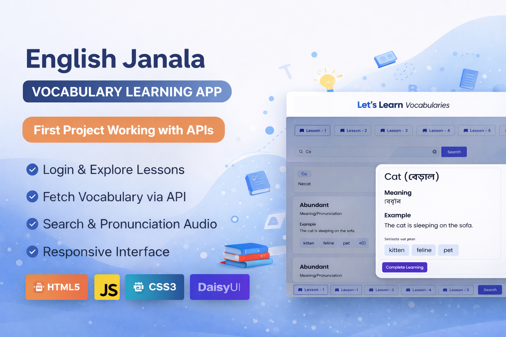

  

<h1 align="center">📘 English Janala – Vocabulary Learning App</h1>

---

# 📌 Project Overview

**English Janala** is an interactive vocabulary learning web application designed to help users learn English words through structured lessons and API-powered vocabulary data.

The platform provides lesson-based vocabulary exploration, pronunciation support, meaning explanations, and contextual examples to enhance learning.

This project represents my **first experience working with APIs in a real web application.**

---

# 🌐 Live Demo

👉 https://rzoshin.github.io/english-janala-vocab-app/

---

# ✨ Key Features

### 🔐 Simple Authentication Interface
Users can log in using a mobile number and PIN to access the learning dashboard.

### 📚 Lesson-Based Vocabulary Learning
Vocabulary is organized into structured lessons to make learning systematic.

### 🔎 Dynamic Vocabulary Search
Users can search for words and instantly view relevant vocabulary results.

### 🧠 Word Details Modal
Each vocabulary word provides:

- Meaning
- Pronunciation
- Example sentence
- Synonyms
- Audio pronunciation

### 🔊 Pronunciation Audio
Users can listen to word pronunciation through an integrated audio feature.

### ❓ FAQ Section
Frequently asked questions help guide users through the platform.

### 📱 Responsive Interface
The UI adapts to different screen sizes for a consistent user experience.

---

# 🛠 Technologies Used

- **HTML5**
- **CSS3**
- **Vanilla JavaScript**
- **Tailwind CSS**
- **DaisyUI**
- **REST API Integration**
- **DOM Manipulation**
- **Event-driven UI updates**

---

# 🧠 Core Concepts Implemented

This project demonstrates:

- Fetching data from external APIs
- Asynchronous JavaScript (`fetch`)
- Dynamic DOM rendering
- Event-based user interactions
- Modal UI components
- Conditional rendering
- Search filtering

---

# 🎯 Why This Project Matters

This project is important in my development journey because it is:

- My **first project that integrates APIs**
- My **first dynamic data-driven application**
- A step forward from static UI to **interactive web applications**

It helped me understand:

- how front-end apps communicate with APIs  
- how to render dynamic data on the page  
- how to manage user interactions in JavaScript  

---

# 🚀 Future Improvements

Potential improvements for this project include:

- User progress tracking
- Favorite vocabulary list
- Quiz system for vocabulary testing
- Dark mode support
- Backend database integration
- User accounts with authentication

---

# 👨‍💻 Author

**Raiyan Zannat**  
CSE Graduate | MSc Engineering Candidate  
Focused on building intelligent, structured, and user-friendly web systems.